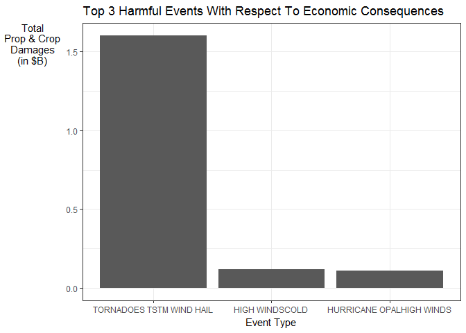

Storms and other severe weather events can cause both public health and economic problems for communities and municipalities. Many severe events can result in fatalities, injuries, and property damage, and preventing such outcomes to the extent possible is a key concern.

This project involves exploring the U.S. National Oceanic and Atmospheric Administration's (NOAA) storm database. This database tracks characteristics of major storms and weather events in the United States, including when and where they occur, as well as estimates of any fatalities, injuries, and property damage.


## Synopsis
For the period between 1950 and 2011, this analysis suggests that **Tornado** causes the greatest total number of fatalities and injuriesis and is the most dangerous weather event to population health. In addition, **Tornadoes Tsunami Wind Hail** is the most damaging to the economy with respect to property and crop damages.


# Data Processing
## Load required libraries

```r
library(dplyr)
library(ggplot2)
```

## Import data

```r
# Download file if not existing
if(!file.exists("StormData.csv.bz2")){
  fileURL = "https://d396qusza40orc.cloudfront.net/repdata%2Fdata%2FStormData.csv.bz2"
  download.file(url = fileURL, destfile = "StormData.csv.bz2")
}

# Read data into dataframe object
raw_data <- readr::read_csv("StormData.csv.bz2") %>% data.frame()
str(raw_data)
```

```
## 'data.frame':	902297 obs. of  37 variables:
##  $ STATE__   : num  1 1 1 1 1 1 1 1 1 1 ...
##  $ BGN_DATE  : chr  "4/18/1950 0:00:00" "4/18/1950 0:00:00" "2/20/1951 0:00:00" "6/8/1951 0:00:00" ...
##  $ BGN_TIME  : chr  "0130" "0145" "1600" "0900" ...
##  $ TIME_ZONE : chr  "CST" "CST" "CST" "CST" ...
##  $ COUNTY    : num  97 3 57 89 43 77 9 123 125 57 ...
##  $ COUNTYNAME: chr  "MOBILE" "BALDWIN" "FAYETTE" "MADISON" ...
##  $ STATE     : chr  "AL" "AL" "AL" "AL" ...
##  $ EVTYPE    : chr  "TORNADO" "TORNADO" "TORNADO" "TORNADO" ...
##  $ BGN_RANGE : num  0 0 0 0 0 0 0 0 0 0 ...
##  $ BGN_AZI   : chr  NA NA NA NA ...
##  $ BGN_LOCATI: chr  NA NA NA NA ...
##  $ END_DATE  : chr  NA NA NA NA ...
##  $ END_TIME  : chr  NA NA NA NA ...
##  $ COUNTY_END: num  0 0 0 0 0 0 0 0 0 0 ...
##  $ COUNTYENDN: chr  NA NA NA NA ...
##  $ END_RANGE : num  0 0 0 0 0 0 0 0 0 0 ...
##  $ END_AZI   : chr  NA NA NA NA ...
##  $ END_LOCATI: chr  NA NA NA NA ...
##  $ LENGTH    : num  14 2 0.1 0 0 1.5 1.5 0 3.3 2.3 ...
##  $ WIDTH     : num  100 150 123 100 150 177 33 33 100 100 ...
##  $ F         : int  3 2 2 2 2 2 2 1 3 3 ...
##  $ MAG       : num  0 0 0 0 0 0 0 0 0 0 ...
##  $ FATALITIES: num  0 0 0 0 0 0 0 0 1 0 ...
##  $ INJURIES  : num  15 0 2 2 2 6 1 0 14 0 ...
##  $ PROPDMG   : num  25 2.5 25 2.5 2.5 2.5 2.5 2.5 25 25 ...
##  $ PROPDMGEXP: chr  "K" "K" "K" "K" ...
##  $ CROPDMG   : num  0 0 0 0 0 0 0 0 0 0 ...
##  $ CROPDMGEXP: chr  NA NA NA NA ...
##  $ WFO       : chr  NA NA NA NA ...
##  $ STATEOFFIC: chr  NA NA NA NA ...
##  $ ZONENAMES : chr  NA NA NA NA ...
##  $ LATITUDE  : num  3040 3042 3340 3458 3412 ...
##  $ LONGITUDE : num  8812 8755 8742 8626 8642 ...
##  $ LATITUDE_E: num  3051 0 0 0 0 ...
##  $ LONGITUDE_: num  8806 0 0 0 0 ...
##  $ REMARKS   : chr  NA NA NA NA ...
##  $ REFNUM    : num  1 2 3 4 5 6 7 8 9 10 ...
```

## Clean data
1. Select the fields that we are interest in:
<ul>
  <li> EVTYPE
  <li> FATALITIES
  <li> INJURIES
  <li> PROPDMG
  <li> PROPDMGEXP
  <li> CROPDMG
  <li> CROPDMGEXP
</ul>

```r
clean_data <- raw_data %>%
  select(EVTYPE, FATALITIES, INJURIES, 
         PROPDMG, PROPDMGEXP, CROPDMG, CROPDMGEXP)
```

2. Mutate to achieve the following effects:
<ul> 
  <li> Set variable values to uppercase
  <li> Remove excess whitespaces and punctuations
  <li> Present `PROPDMG` and `CROPDMG` with the exponentials
  <li> Filter out summary values
</ul>

```r
clean_data <- clean_data %>%
  mutate(EVTYPE = toupper(gsub("\\s+", " ", EVTYPE)),
         PROPDMGEXP = toupper(PROPDMGEXP),
         CROPDMGEXP = toupper(CROPDMGEXP)) %>%
  mutate(EVTYPE = gsub("[[:punct:]]", "", EVTYPE)) %>%
  mutate(PROPDMG = PROPDMG * ifelse(PROPDMGEXP == "K", 10 ** 3,
                                    ifelse(PROPDMGEXP == "M", 10 ** 6,
                                           ifelse(PROPDMGEXP == "B", 10 ** 9, 
                                                  ifelse(PROPDMGEXP == "H", 10 ** 2,
                                                         ifelse(PROPDMGEXP == "\\d", 10 ** PROPDMGEXP,
                                                                1))))),
         CROPDMG = CROPDMG * ifelse(CROPDMGEXP == "K", 10 ** 3,
                                    ifelse(CROPDMGEXP == "M", 10 ** 6,
                                           ifelse(CROPDMGEXP == "B", 10 ** 9, 
                                                  ifelse(CROPDMGEXP == "H", 10 ** 2,
                                                         ifelse(CROPDMGEXP == "\\d", 10 ** CROPDMGEXP,
                                                                1)))))) %>%
  filter(!grepl("^SUMMARY", EVTYPE))
```


# Results
1. Across the United States, which types of events (as indicated in the `EVTYPE` variable) are most harmful with respect to population health?

For this question, the total number of fatalities and injuries is computed for each event type. Then the top 3 events that are most harmful to population health is plotted. It can be seen that **Tornado** is the most harmful.

```r
clean_data %>% 
  select(EVTYPE, FATALITIES, INJURIES) %>%
  group_by(EVTYPE) %>%
  summarise(TOTAL = sum(FATALITIES) + sum(INJURIES)) %>%
  arrange(desc(TOTAL)) %>%
  head(3) %>%
  ggplot(aes(x = reorder(EVTYPE, -TOTAL), y = TOTAL)) +
  geom_bar(stat = "identity") +
  labs(x = "Event Type", y = "Total\nFatalities\n& Injuries",
       title = "Top 3 Harmful Events With Respect To Population Health") +
  theme_bw() +
  theme(axis.title.y = element_text(angle = 0))
```

<!-- -->


2. Across the United States, which types of events have the greatest economic consequences?
For this question, the total economic cost is computed for each event type based on both property and crop damages. Then the top 3 events that are most harmful to the economy is plotted. It can be seen that **Tornadoes Tsunami Wind Hail** is the most harmful.

```r
clean_data %>% 
  select(EVTYPE, PROPDMG, CROPDMG) %>%
  group_by(EVTYPE) %>%
  mutate(TOTALDMG = PROPDMG + CROPDMG) %>%
  summarise_all(sum) %>%
  arrange(desc(TOTALDMG)) %>%
  head(3) %>% 
  ggplot(aes(x = reorder(EVTYPE, -TOTALDMG), y = TOTALDMG / 10 ** 9)) +
  geom_bar(stat = "identity") +
  labs(x = "Event Type", y = "Total\nProp & Crop\nDamages\n(in $B)",
       title = "Top 3 Harmful Events With Respect To Economic Consequences") +
  theme_bw() +
  theme(axis.title.y = element_text(angle = 0))
```

<!-- -->

